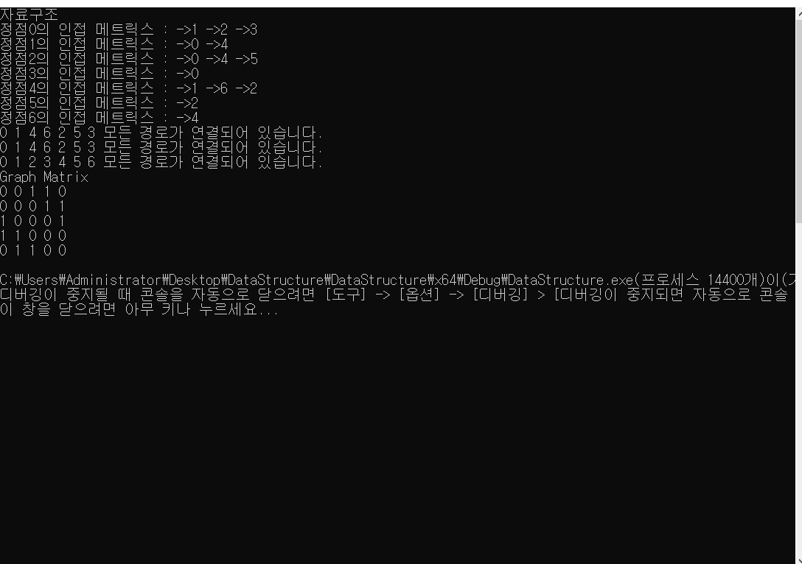

# DataStructure

## 자료 구조의 종류

|자료구조| 장점 | 단점 | 사용 예시 | 이미지 |
|--------|------|------|---------------|-------|
|vector|빠른 임의 접근 끝에서 빠른 삽입/삭제|중간 삽입/삭제가 느림 크기 조정 시 비용이 큼|아이템 목록 리스트 인벤토리 아이템|-|
|lis   |빠른 삽입/삭제(어디서든) 메모리 사용이 효율적임|임의 접근이 느림|큐 구현 AI 행동 목록|-|
|deque|양쪽에서 빠른 데이터 삽입/삭제 vector장점을 그대로 가짐|중간 삽입이 느림 vector보다 메모리를 더 사용함|명령어 히스토리 기능 구현|-|
|set|빠른 검색/삽입 자동 정렬 중복이 허용이 안됨|추가 메모리 사용|단일 아이템 구현|-|
|multiSet|set동일하나 중복안됨|set과 동일함|아이템 드랍 테이블 id - droptable( )|-|
|map|pair클래스를 이용해서 key와 value로 빠른 검색 사용 가능|삽입,삭제 시 rebuilding|게임 설정 저장 구현|-|
|unordered set,map| hash로 구현한 자료구조, 매우 빠른 검색|정렬되지 않은 상태, 추가 메모리 사용|게임에서 빠르게 검색이 필요한 경우에는 대부분 사용함|-|
|graph|복잡한 관계를 표현가능|구현이 복잡함|네비게이션 길차기, AI Behaviour Tree|-|
